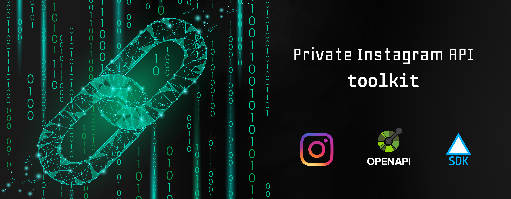

# instagram-api-toolkit

<!-- ## Instagram Private API SDKs -->

### Use the library

If you want to get access to the **instagram private api** you need to download the sdk depending on the language/framework you are using, here you can find the sdks available (open the spoiler below).

List of SDK for Instagram Private API

  | Language/Framework | Package | Install or Download |
  | --- | --- | --- |
  | python | [private_instagram_sdk](sdks/python) | *Not published on PyPi*

**(more on >> [Instagram Private API SDKs](/sdks))**

### Explain the idea

If you are a coder/programmer/developer and you want to access to the instagram api you already know that this is "not" possible, unless you use the public api, because the private api is only accessible from the Instagram mobile app.

But **probably** you also know that someone can fake all parts of a request to an API so it's also possible to make Instagram think that our api calls are sended from his mobile app.
Already there are many library that are trying to do just that, fake itself as an instagram mobile app and send login and other requests to the instagram private api.

*So* the idea was to create a **single source of truth** ([SSOT](https://en.wikipedia.org/wiki/Single_source_of_truth)) and keep in mind various principles of software design and software development like [DRY](https://en.wikipedia.org/wiki/Don%27t_repeat_yourself) and [KISS](https://en.wikipedia.org/wiki/KISS_principle).

### API design process

To define a SSoT there is the needing of a standard to use and there isn't a better way to create a schema than using the [OpenAPI Specification v3](https://github.com/OAI/OpenAPI-Specification/blob/master/versions/3.0.2.md). 

To inspect the actual schema you can just go to the folder [/api](/api) and see all schema's files.

---

## Goal

To accomplish the goal:

1. We need to define a schema of the private instagram api using the [OpenAPI Specs](https://github.com/OAI/OpenAPI-Specification).

2. Then we can use this language-agnostic schema to generate automatically an SDK/Client for every language or framework we want (unless we have generators we can create the SDK) using a [OpenAPI Generators](https://openapi-generator.tech/docs/generators) or [OpenAPI Codegen](https://github.com/Mermade/openapi-codegen).

---

## Contribute to this project

If you want to be part of the contributors of this project, read the instructions in [DEV.md](/DEV.md).
